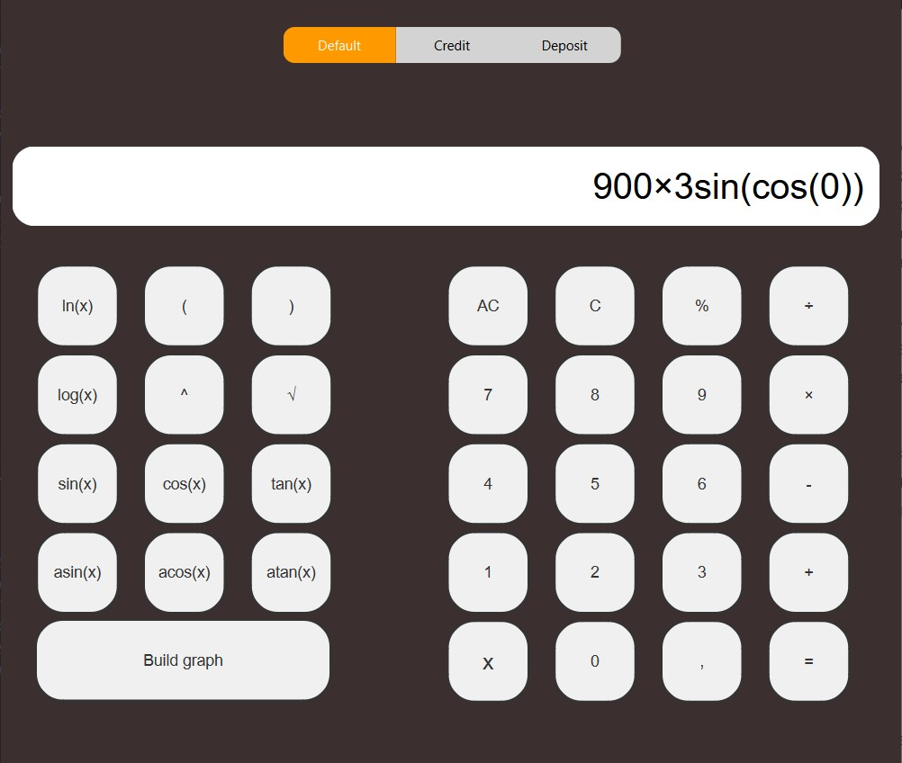
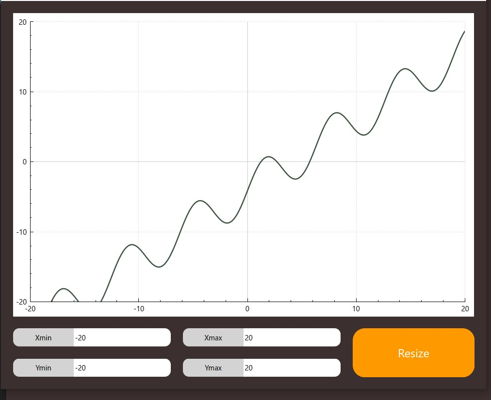
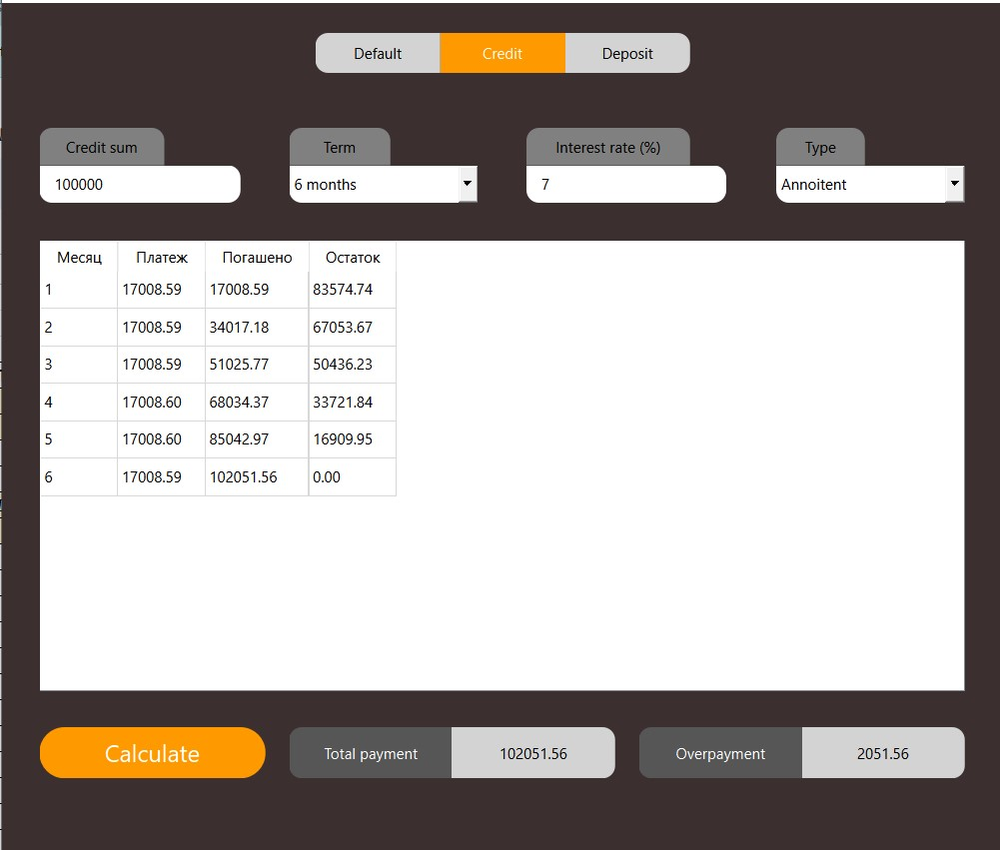
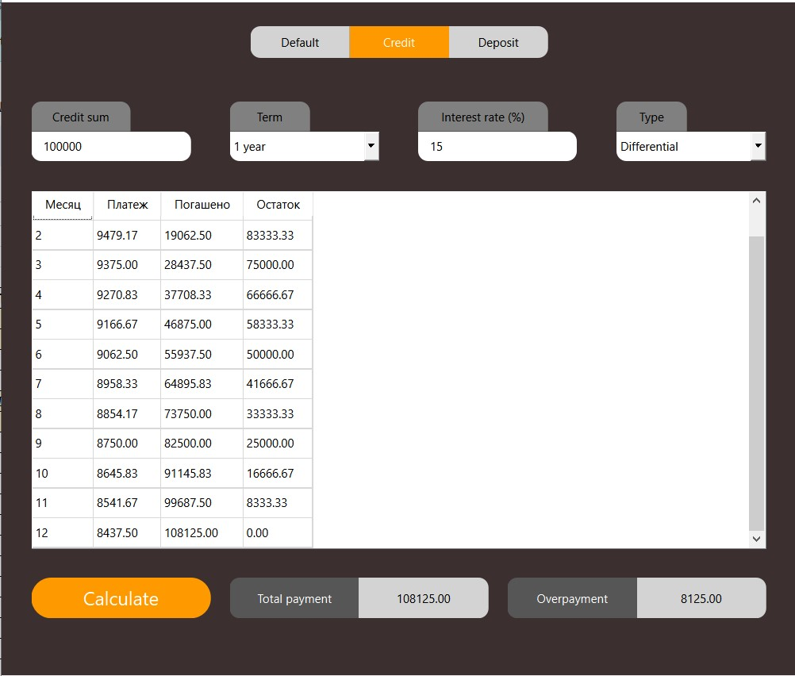
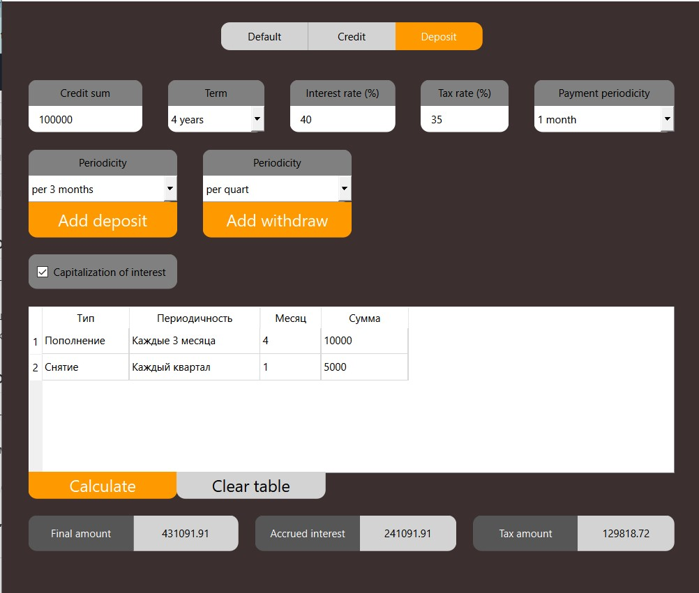

# Многофункциональный инструмент гигачада (МИГ-3)

## Introducion
Данный проект сочетает в себе самые необходимые инструменты уверенного в себе программиста (на момент написания описания, их три), без которых немыслимо представить себе жизнь, а именно:
- Проектный Инженерный Совмещенный (с построением графиков) Калькулятор (ПИСК-1)
- Кредитный Ежемесечный Конвертер (КЕК-2)
- Депозитный Энергосберегающий Балансировщик (ДЭБ-3)

Представленные проекты реализованы ппри помощи фреймворка QT, имеют приятный глазу дизайн и пентагоновскую защиту от взлома (ну почти)

## ПИСК-1
Данный модуль представляет собой реализацию инженерного калькулятора, с поддержкой основных математических функций. Калькулятор анализирует введенные формулы, не позволяя продолжать работу с некорректным вводом, а местами заменяет ввод пользователя на корректный (пример: попытка закрыть больше скобок, чем было открыто, или ввод нескольких операторов подряд друг за другом). Решение введенных запросов реализовано с помощью преобразования в польскую нотацию.

Также, в ПИСК-1 заложена возможность построения графиков заданых функций, аналогично известному инструменту Wolfram Alpha, с изменением масштаба и положения.

Примеры работы программы:

 

## КЕК-2
Кредитный Ежемесечный Конвертер предоставляет любому заинтересованному лицу узнать подробные условия по кредиту, который он планирует взять в дальнейшей перспективе. Доступен расчет как аннуитентных, так и дифференцированных платежей c детальным разъяснением по каждому месяцу.

Примеры работы программы:

 

## ДЭБ-3
Депозитный Энергосберегающий Балансировщик создан для категории людей, планирующих положить деньги на вклад и интеесующихся условиями, зависимымы от множества факторов. Данный депозитный калькулятор позволяет учесть такие факторы, как
- срок вложения
- процентная ставка
- налоговая ставка
- периодичность капитализации и ее наличие
- пополнение и снятие средств со счета в период действия вклада
Анализируя вышеперечисленные критерии, ДЭБ возвращает информацию об итоговом размере средств, начисленных процентах, а также об удержанном налоге

Примеры работы программы:

